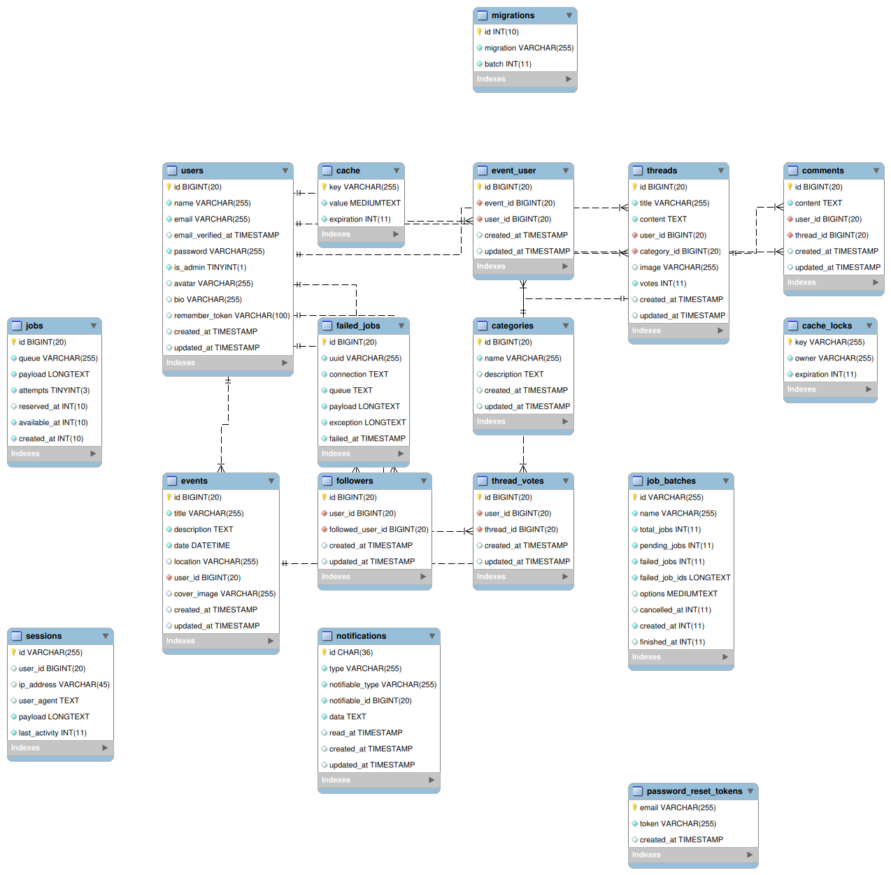

# Birbum

## Descripción
Birbum es una plataforma interactiva diseñada para propietarios de pájaros como mascotas. Permite a los usuarios compartir experiencias, consejos sobre el cuidado de sus aves y crear una comunidad en torno a la tenencia responsable de mascotas aviares. Además, incluye recursos educativos sobre las diferentes especies de pájaros, su comportamiento, alimentación y salud.

## Características
- **Sistema de Notificaciones**: Notificaciones en tiempo real para mantener a los usuarios informados sobre actividades relevantes.
- **Eventos y Actividades**: Organización de eventos virtuales o presenciales, como charlas, concursos de fotos y encuentros de propietarios.
- **Interacción Social**: Participación en foros temáticos y votación de publicaciones.
- **Gestión de Perfiles**: Personalización de perfiles de usuario con avatares y biografías.

## Tecnologías Utilizadas

### Front-end
- **HTML5**: Estructura semántica y accesible.
- **CSS3**: Estilos visuales atractivos y responsivos con Tailwind CSS.
  - **Tailwind CSS**: Framework para diseño rápido y eficiente.
  - **DaisyUI**: Componentes predefinidos para mejorar la experiencia del usuario.
- **JavaScript**: Interactividad y manipulación del DOM.
  - **Alpine.js**: Framework ligero para manejar la interactividad.

### Back-end
- **Laravel**: Framework robusto para la lógica del servidor y la interacción con la base de datos.
  - **Breeze**: Autenticación de usuarios.
  - **Pusher**: Notificaciones en tiempo real.

### Base de Datos
- **MariaDB**: Sistema de gestión de bases de datos para almacenar información de usuarios, eventos y más.

## Instalación
1. Clona el repositorio:
   ```bash
   git clone <URL_DEL_REPOSITORIO>
   cd birbum
   ```
2. Instala las dependencias de PHP y Node.js:
   ```bash
   composer install
   npm install
   ```
3. Configura el archivo `.env`:
   ```bash
   cp .env.example .env
   nano .env
   ```
4. Genera la clave de la aplicación y ejecuta las migraciones:
   ```bash
   php artisan key:generate
   php artisan migrate --seed
   ```
5. Compila los assets:
   ```bash
   npm run build
   ```

## Despliegue
1. Configura un servidor web (Nginx o Apache) para servir la aplicación.
2. Asegúrate de que los permisos de las carpetas `storage` y `bootstrap/cache` sean correctos:
   ```bash
   sudo chown -R www-data:www-data storage bootstrap/cache
   sudo chmod -R 775 storage bootstrap/cache
   ```
3. Configura SSL con Let's Encrypt y un firewall para proteger el servidor.

## Diagrama Relacional

A continuación se muestra el diagrama relacional de la base de datos utilizada en Birbum. Este diagrama ilustra las relaciones entre las diferentes tablas y cómo se estructuran los datos.




## Contribución
¡Las contribuciones son bienvenidas! Por favor, abre un issue o envía un pull request para sugerir mejoras o reportar problemas.